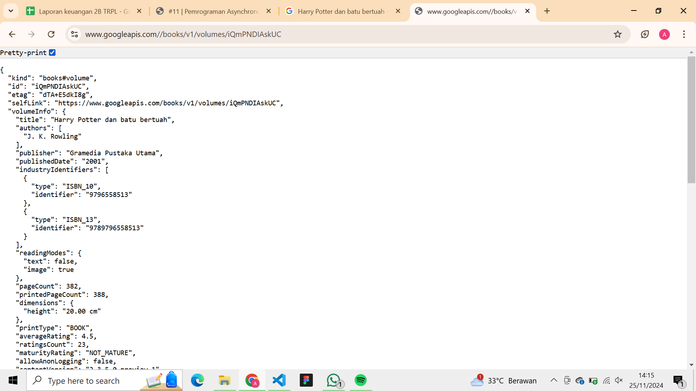
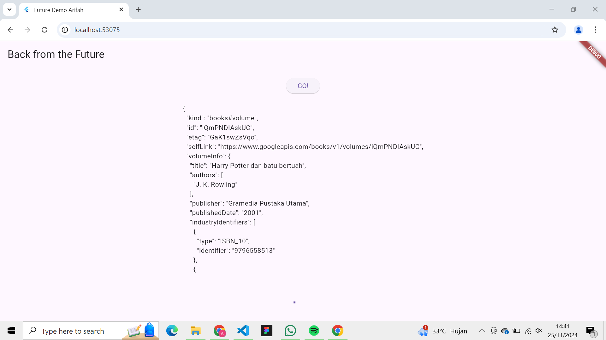
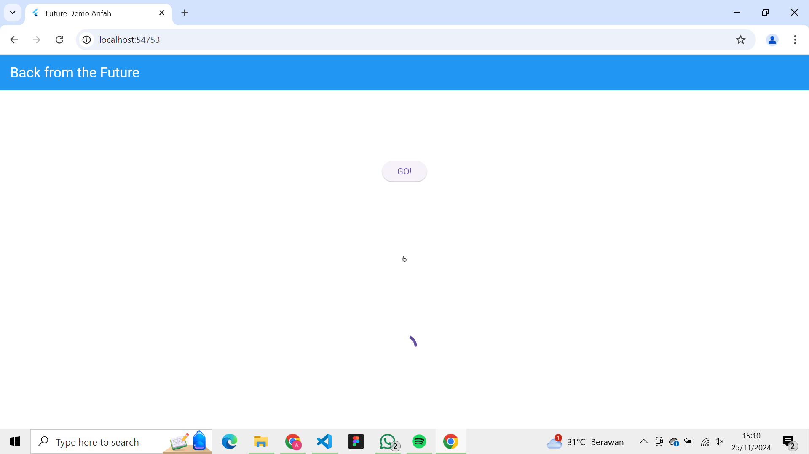

Nama : Arifah Nur Basyiroh Machi 
NIM : 362358302018
Kelas : 2B TRPL

SOAL 2

SOAL 3
Jelaskan maksud kode langkah 5 terkait substring dan catchError!
Jawab :
- Substring adalah metode atau fungsi dalam banyak bahasa pemrograman yang digunakan untuk mengambil bagian tertentu dari sebuah string (sub-bagian string). Fungsi ini biasanya menerima parameter awal (index) dan akhir (opsional) untuk menentukan bagian string yang ingin diambil.

- catchError biasanya merujuk pada mekanisme penanganan error (kesalahan) dalam bahasa pemrograman.

Hasil:

SOAL 4
Jelaskan maksud kode langkah 1 dan 2!
Jawab :
Langkah 1 :
Kode tersebut mensimulasikan operasi yang membutuhkan waktu tertentu dengan penundaan menggunakan Future.delayed. Hal ini berguna dalam mengelola proses asinkron dalam aplikasi.

Langkah 2 : 
Kode tersebut adalah fungsi asinkron dalam bahasa Dart yang menghitung total nilai yang diperoleh dari tiga fungsi returnOneAsync, returnTwoAsync, dan returnThreeAsync. Fungsi ini juga memperbarui tampilan (UI) dengan memanfaatkan setState untuk mengubah nilai variabel result.

Hasil:
